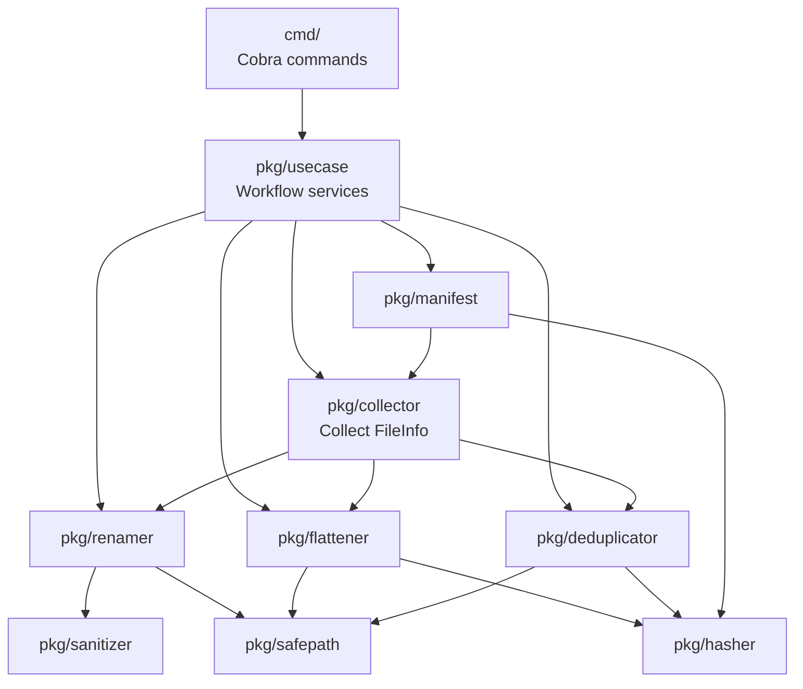
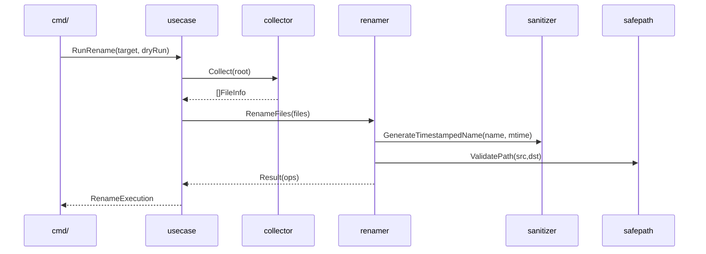
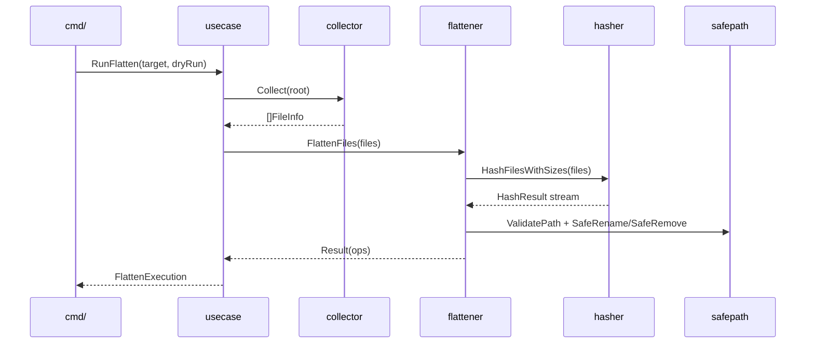
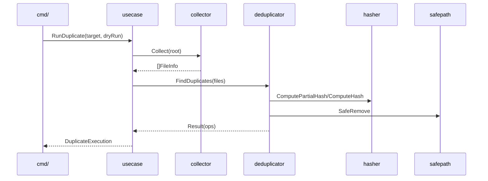
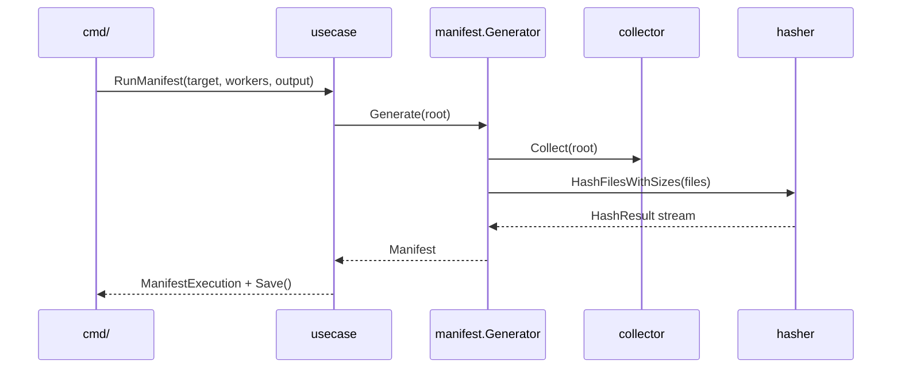

# Architecture

This document explains how `file-organizer` is structured and how data flows
through the major components. It is meant to be a mental map for reading and
modifying the code.

## Quick orientation

- Entry point and CLI wiring: `cmd/`
- Core packages:
  - `pkg/usecase`: application/service orchestration for command workflows
  - `pkg/collector`: walks directories, returns `FileInfo` metadata
  - `pkg/sanitizer`: normalizes filenames for rename phase
  - `pkg/safepath`: enforces root containment for all filesystem mutations
  - `pkg/renamer`: phase 1 (rename in place)
  - `pkg/flattener`: phase 2 (move to root, remove duplicates by content)
  - `pkg/deduplicator`: phase 3 (remove duplicates by content hashing)
  - `pkg/hasher`: SHA256 hashing + worker pool
  - `pkg/manifest`: inventory generation (hash + size + mtime)

## Components at a glance

## Data model

All phases operate on a shared metadata model from `pkg/collector`:

- `collector.FileInfo`
  - `Path`, `Dir`, `Name`, `Size`, `ModTime`

This struct is passed into rename, flatten, and duplicate phases to avoid
repeated filesystem stat calls.

## Command flows

### Rename (phase 1)

Goal: rename files in place to a consistent, timestamped format.

Key behavior:

- Filename normalization is delegated to `pkg/sanitizer`.
- Collisions in the same directory add suffixes, or mark duplicates.
- `pkg/safepath` guards all renames and deletions.

### Flatten (phase 2)

Goal: move everything to the root directory and remove true duplicates.

Key behavior:

- Pre-computes SHA256 for all files and uses hash equality to detect duplicates.
- Files already in root are skipped but still register in the hash map.
- Name conflicts get suffixes (`_1`, `_2`, ...).
- Empty directories are removed after moves when not in dry-run.

### Duplicate (phase 3)

Goal: remove duplicates using content hashing with a size-based pre-filter.

Key behavior:

- Step 1: group by file size (fast filter).
- Step 2: for large files, use partial hash (first+last 4KB).
- Step 3: confirm with full SHA256 to avoid false positives.
- The "kept" file is the first in path-sorted order for determinism.

### Manifest

Goal: create a JSON inventory of all files and content hashes.

Key behavior:

- Uses the same collector and hasher pipeline.
- Paths are stored relative to the root for portability.

## Safety and invariants

- All filesystem mutations go through `pkg/safepath.Validator`.
- The root path is resolved and validated in `pkg/usecase` before each workflow.
- Dry-run mode avoids any mutating operation but still reports planned changes.

## Concurrency model

Hashing uses `pkg/hasher` with a worker pool (`workers` flag, default CPU count).
Both flattener and manifest use the concurrent hashing API.

## Extension points

If you add a new phase or command:

- Use `collector` for consistent file discovery.
- Use `safepath.Validator` for all file mutations.
- Prefer `hasher` when content identity matters.
- Follow the existing pattern in `cmd/` for summaries and dry-run output.
