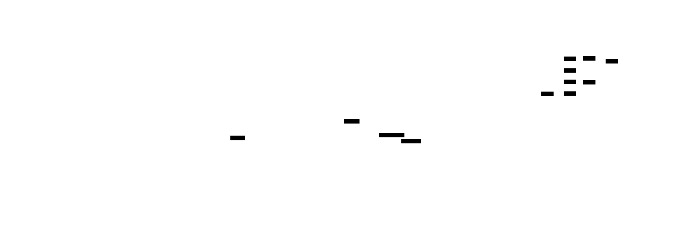
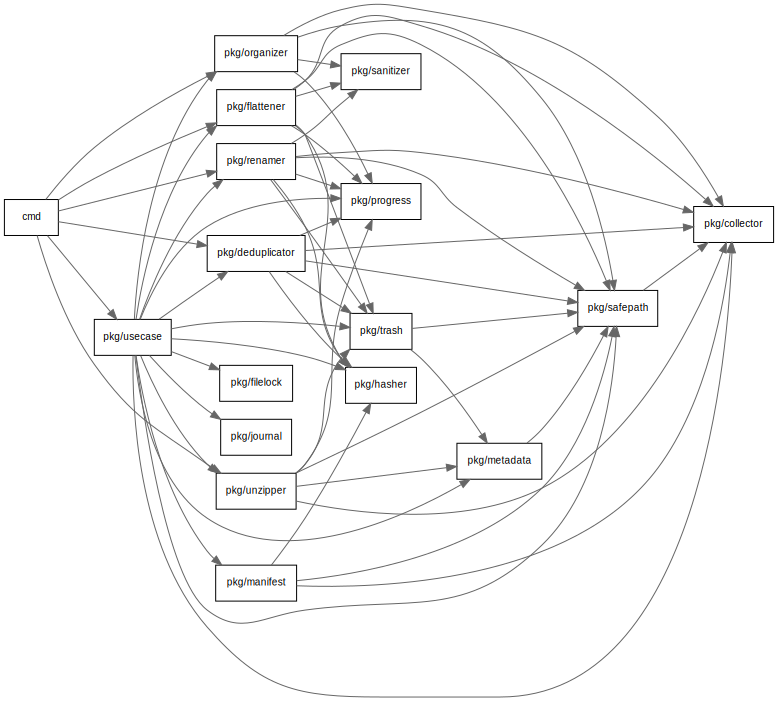

# Architecture

btidy is a CLI tool for cleaning up messy backup directories. Every mutating command shares the same safety infrastructure: path validation, soft-delete via trash, operation journaling, and advisory file locking.

## Layer structure



Code is organized into three layers with strict downward dependencies:

- **`cmd/`** — Cobra CLI definitions. Each command file handles flags and output formatting. No business logic lives here.
- **`pkg/usecase/`** — Orchestration. `Service` coordinates the shared workflow (lock, collect, snapshot, execute, journal) using Go generics to eliminate boilerplate across commands.
- **`pkg/*`** — Domain packages. Each handles one responsibility: `collector` walks files, `hasher` computes SHA-256, `renamer` adds timestamp prefixes, and so on. Every domain package that mutates files accepts a `safepath.Validator` via its `NewWithValidator()` constructor.

## Request lifecycle


Every mutating command follows a five-phase workflow implemented by `runFileWorkflow[T]()` in `pkg/usecase/service.go`:

1. **Lock** — `filelock.Acquire()` takes a non-blocking advisory lock on `.btidy/lock`.
2. **Collect** — `collector.Collect()` walks the target directory, returning `[]FileInfo`.
3. **Snapshot** — `manifest.Generate()` creates a pre-operation cryptographic inventory in `.btidy/manifests/`.
4. **Execute** — The command-specific domain package runs (e.g. `renamer.RenameFilesWithProgress()`). This is the only phase that varies per command.
5. **Journal** — `writeJournal()` records two-phase entries (intent then confirmation) to `.btidy/journal/<run-id>.jsonl`.

Phases 1, 2, 3, and 5 are identical for all commands. Phase 4 is injected as an executor function (`renameExecutor()`, `flattenExecutor()`, etc.).

## Safety model


Safety is not a feature — it is the architecture. These mechanisms form a connected system:

- **Path validator** — `safepath.Validator` is created once from the target directory and injected into every domain package. All file operations (`SafeRename`, `SafeRemove`, `SafeMkdirAll`) go through it. Rejects path escape, symlink escape, and root removal.
- **Advisory lock** — `.btidy/lock` prevents concurrent btidy processes on the same directory. Non-blocking; fails immediately if held.
- **Trash** — Files are moved to `.btidy/trash/<run-id>/` preserving their relative directory structure. Never permanently deleted except by explicit `purge`.
- **Journal** — Every mutation is recorded as a two-phase JSONL entry. Intent (`Success: false`) is written first, confirmation (`Success: true`) after. Enables `undo` and crash detection.
- **Undo** — Reads the journal in reverse, restoring trashed files and reversing renames. Verifies content hashes before restoring.
- **Manifest snapshots** — Pre-operation SHA-256 inventory enables before/after comparison.

## `.btidy/` directory

```
.btidy/
  lock                                  # Advisory file lock
  trash/<run-id>/...                    # Soft-deleted files (mirrors original structure)
  manifests/<run-id>.json               # Pre-operation manifest snapshots
  journal/<run-id>.jsonl                # Operation journals (two-phase entries)
  journal/<run-id>.rolled-back.jsonl    # Journals after successful undo
```

Run IDs follow the format `<command>-YYYYMMDDTHHmmss` (e.g. `flatten-20260208T143022`).

## Dependency graph



Auto-generated from `go list -json ./...`. Regenerate with `make docs-deps`.

## Why these decisions

1. **Single validator instance** — Creating `safepath.Validator` once and injecting it everywhere guarantees consistent path boundary enforcement. No package can accidentally bypass validation.
2. **Trash instead of delete** — Soft-delete with directory structure preservation makes undo trivial. The trash mirrors the original path hierarchy so files restore to their exact original locations.
3. **Two-phase journal** — Intent-then-confirm entries distinguish completed operations from interrupted ones. A journal with an unconfirmed intent entry signals a crash mid-operation.
4. **Go generics for workflow** — `runFileWorkflow[T]()` and `runCheckedExecution[T, E, O]()` eliminate the boilerplate of lock/collect/snapshot/journal across eight commands while keeping each command's execute phase type-safe.
5. **Advisory file locking** — `flock(LOCK_EX|LOCK_NB)` on Unix prevents concurrent btidy processes without requiring external coordination. The lock is released on `defer` so cleanup happens even on error paths.
6. **Domain packages with no upward dependencies** — Each domain package depends only on other domain packages (never on `usecase` or `cmd`). This keeps packages testable in isolation and prevents circular imports.
7. **Relative paths in journals** — Journal entries store paths relative to the target root. This makes journals portable and avoids encoding machine-specific absolute paths.

## Regenerating diagrams

```bash
make docs        # Render all diagrams (D2 + dependency graph)
make docs-d2     # Render D2 diagrams only
make docs-deps   # Render dependency graph only (requires graphviz)
make tools       # Install D2 and other development tools to .tools/
```

D2 diagrams are hand-maintained in `docs/*.d2`. The dependency graph is auto-generated from actual Go imports by `scripts/depgraph.sh`.
